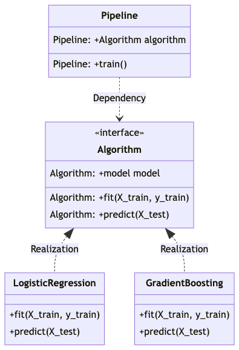

# Strategy Design Pattern for Effective ML Pipeline

## Learning Objective

We will learn about two Python design patterns that come really handy in Data Science projects i.e. Strategy and Factory. They help us structure complex problems into smaller pieces so then it becomes easier to expand and modify, hence Effective ML Pipeline.

## Class Diagram

This diagram depicts example of implementation Strategy and Factory pattern in training ML pipeline.
The context object is Pipeline class. It has two interfaces: Algorithm and FeatureEnricher.
The interface classes are realized in Concrete Factory classes e.g. LogisticRegression, GradientBoosting etc.
It enables us to easily modify and extend our code to bigger and more complex problem with minimal changes in the context object.



> I use [mermaid.live](https://mermaid.live/) to generate the class diagram.

## Environment

This scripts run using python 3.9. I use Anaconda to set the environment.
Install the Anaconda first and then open terminal

```bash
conda create --name new_environment python=3.9 # create new environment
conda activate new_environment # activate the env
pip install -r requirements.txt # install packages in requirements.txt
```
